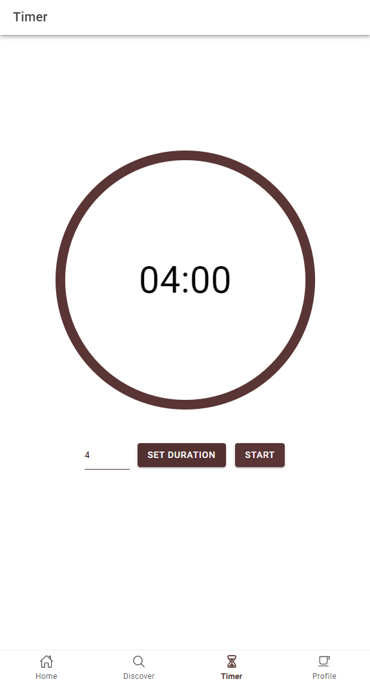

## Brew Buddy

Brew Buddy is a simple tea companion that allows users to manage their tea collection.

It lets you create favorite and owned tea lists while also making it possible to set your preferred infusion time for each one. 

It also makes tea brewing really easy! Just look at your tea list and each tea will have a timer with your preferred infusion time next to it.

## Technical Description

A mobile application with an Angular Ionic frontend and a Swagger API backend built using Flask Restx.

A project in collaboration with <a href="https://github.com/m-rau5" target="_blank">Raul Mois</a>, who was responsible for the backend of this app.

<a href="https://github.com/m-rau5/brew-buddy-swagger-api" target="_blank">Link to the Flask backend</a>

## Application functionalities

- Sign In Page (if you have an account)
<kbd>
  
</kbd>  

- Sign Up Page (create one if you don't)
<kbd>
  
</kbd>  

- Home Page (where you first land, showcasing the favorite & owned teas for easier access, allowing you to instantly start a brewing timer for them)
<kbd>
  
</kbd>  

- Discover Page (allows you to see all the available teas from Casa de Ceai and easily access them)
<kbd>
  
</kbd>  

- Filter (allows you to filter teas based on some categories)
<kbd>
  
</kbd>  

- Search (allows you to search teas)
<kbd>
  
</kbd>  

- Individual Tea Page (after clicking on a tea you get redirected to its individual page where you see all the details about them, and even start an instant timer with the recommended minimum or maximum brewing time)
<kbd>
  
</kbd>  

- Timer Page (you can instantly start, pause, continue, and restart a timer based on a time that you set)
<kbd>
  
</kbd>  

- Profile Page - Favourite Teas (see and access all of your favorite teas in one place)
<kbd>
  
</kbd>  

- Profile Page - Owned Teas (see and access all of your owned teas in one place)
<kbd>
  
</kbd>  

Also from the profile, you can edit your email and username.

